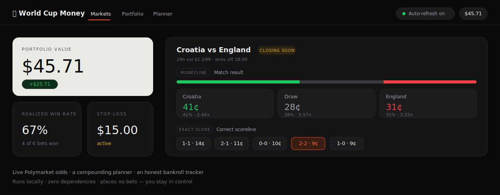

<div align="center">

# ⚽ World Cup Money

**A local, trading-grade dashboard for disciplined, compounding World Cup bets.**

Live Polymarket odds, a compounding-chain planner, and an honest bankroll tracker —
in one dark, fast, single-file web app that runs on your own machine and **places no bets for you**.




</div>

---

## Why this exists

Betting on the World Cup is more fun when you're disciplined about it. The idea here is simple:
make one educated bet, roll the winnings into the next match, and compound a small bankroll across
the day — while never lying to yourself about the odds.

This app is the calculator and the scorekeeper for that game plan. It pulls the live market odds,
does every bit of the betting math, sizes your compounding chain, and keeps an honest record of how
you're actually doing. **The edge stays with your judgment** — the app just removes the arithmetic
mistakes and enforces the discipline (like a stop-loss) that's hard to keep in the heat of a match.

> It is a **track & advise** tool. It never connects to a wallet, never holds a private key, and
> never moves a cent. You place every real bet yourself on Polymarket. That's the point.

## Features

- **📊 Live odds, grouped by match.** One card per game showing *every* market Polymarket lists —
  **moneyline** (win / draw / win), **total goals**, and **exact scores** (`0-0`, `2-2`, …) — each
  with a probability bar, cents pricing (`41¢`), implied probability, and decimal odds.
- **🧾 One-click bet slip.** Tap any outcome to open a slip with quick-stake chips and a live
  read-out of shares, potential payout, and profit before you commit.
- **🔁 Compounding planner.** Type the prices for the legs you want to chain and see your projected
  bankroll after each winning leg — plus the **combined probability that the whole chain lands**, the
  honest reality check on parlaying your luck.
- **💰 Bankroll tracker with a stop-loss.** Set a starting portfolio and a floor; the app tracks your
  running balance, your **realized win rate** (your actual track record, not the market's guess), and
  tells you when to walk away.
- **⏱️ Live auto-refresh.** Odds re-pull every 30 seconds during matches, with a price-flash on every
  outcome that moved.

## Run it on the web (one click)

Want a link you just open — on your laptop or your phone — with live, auto-refreshing
odds and nothing to install? Deploy your own copy to Vercel's free tier:

[](https://vercel.com/new/clone?repository-url=https%3A%2F%2Fgithub.com%2Fsamofthesaints%2Fworldcupmoney)

It needs no configuration — the included serverless function (`api/markets.js`) proxies
Polymarket's odds so the page works anywhere, and your bankroll and bets are stored
privately in your own browser. Once connected to this repo, every update redeploys
automatically.

## Run it locally

You need [Python 3](https://www.python.org/downloads/). That's the only requirement — no `pip install`,
no framework, no build step. One command downloads and launches it (your browser opens automatically):

**macOS / Linux**
```bash
cd ~ && curl -L https://github.com/samofthesaints/worldcupmoney/archive/refs/heads/main.tar.gz -o wcm.tar.gz && tar xzf wcm.tar.gz && cd worldcupmoney-main && python3 app.py
```

**Windows (PowerShell)**
```powershell
cd ~; iwr https://github.com/samofthesaints/worldcupmoney/archive/refs/heads/main.zip -OutFile wcm.zip; Expand-Archive wcm.zip -DestinationPath . -Force; cd worldcupmoney-main; python app.py
```

Then it's live at **http://localhost:8000**. Press `Ctrl+C` in the terminal to stop it.

Already cloned the repo? Just run `python3 app.py` from inside the folder.

## How the math works

Polymarket prices are probabilities between 0 and 1 — a `64¢` price means the market thinks an outcome
is **64% likely**. Buy a share at price `p`:

| Quantity | Formula | Example at `0.62` on `$20` |
|---|---|---|
| Implied probability | `p` | 62% |
| Decimal odds | `1 / p` | 1.61× |
| Payout on a win | `stake / p` | $32.26 |
| Profit on a win | `stake · (1 − p) / p` | $12.26 |

**Compounding** rolls the full payout into the next leg. Chaining `0.62 → 0.55 → 0.70` turns `$20`
into `$83.81` if all three hit — but the planner also shows the catch: that run has only a
**~24% combined chance** (`0.62 × 0.55 × 0.70`). More legs, bigger upside, lower odds of the full run.

### The one timing rule

A match market only pays out *after* that match resolves, so you can only chain matches with
**staggered kickoffs**. On the final group matchday all six matches in a group kick off at once —
no compounding those days. The app flags this for you.

## Privacy & safety

- **No wallet, no keys, no trades.** The app only *reads* public Polymarket data.
- **Your bets stay on your machine.** They're saved to `data/session.json` locally and are
  git-ignored — your betting record is never uploaded, even though this repo is public.
- **Bet responsibly.** Only stake money you're completely fine losing, and treat the stop-loss as a
  hard rule. No app can predict a football match.

## Under the hood

- **Backend** — a single `app.py` using only the Python standard library (`http.server`,
  `urllib`). Reads Polymarket's Gamma API, computes the betting math, and persists session state to a
  local JSON file.
- **Frontend** — one `index.html`, vanilla JS, no build tooling. Implements a custom dark, data-dense
  **design system** (Inter + JetBrains Mono, a single orange accent, green/red reserved strictly for
  market direction) — see [`design.md`](design.md) if included.

```
worldcupmoney/
├── app.py          # zero-dependency local server + betting math
├── index.html      # the dashboard (design-system UI, vanilla JS)
├── docs/preview.svg
└── data/           # your local bankroll & bets (git-ignored)
```

## License

[MIT](LICENSE) — do whatever you like. No warranty; bet at your own risk.
